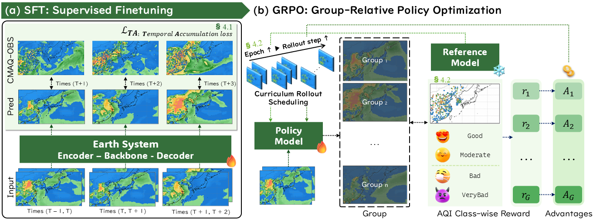
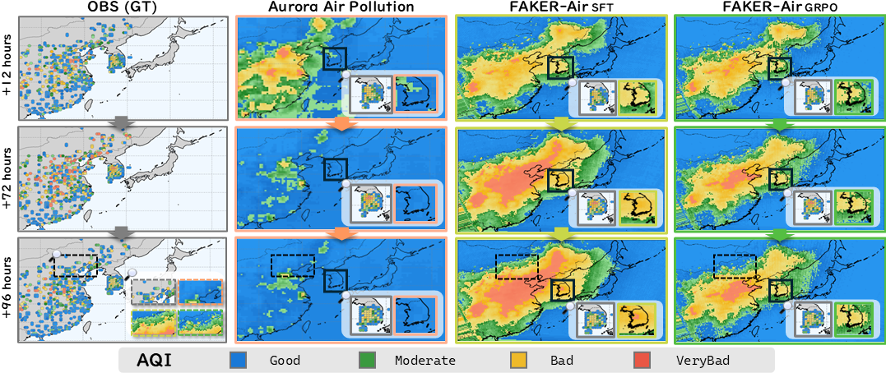

# [CVPR 2026] FAKER-Air: Real-Time Long Horizon Air Quality Forecasting via Group-Relative Policy Optimization

### ⭐ Link to Paper: [Link](https://www.arxiv.org/abs/2511.22169)
### 📚 Link to Dataset: [Link](https://huggingface.co/datasets/2na-97/FAKER-Air)
### 🍟 Link to Pretrained Weight: [Link](https://huggingface.co/2na-97/FAKER-Air)

<p align="center">
  
  <br>
  <em>FAKER-Air effectively captures dynamic temporal variations in PM concentration over long horizons (120h), significantly reducing False Alarm Rates compared to standard foundation models.</em>
</p>


## Introduction

**FAKER-Air** (Forecast Alignment via Knowledge-guided Expected-Reward) is a two-stage framework for reliable, real-time, long-horizon (up to 5 days) Particulate Matter (PM) forecasting.

[](https://www.google.com/search?q=LICENSE.txt)

While foundation models like **Aurora** offer global generality, they often fail to capture region-specific dynamics and suffer from **decision-cost mismatch**, leading to high False Alarm Rates (FAR) in operational settings. FAKER-Air addresses this by:

1.  **CMAQ-OBS Dataset:** Utilizing a new regional dataset that pairs real-time observations with physics-based CMAQ reanalysis.
2.  **Stage 1 (SFT):** Supervised Fine-Tuning with **Temporal Accumulation Loss** to mitigate exposure bias.
3.  **Stage 2 (GRPO):** **Group-Relative Policy Optimization** with class-wise rewards and curriculum rollout to align predictions with operational public health priorities (reducing false alarms while maintaining recall for severe events).

This repository contains the official implementation of the paper **"Real-Time Long Horizon Air Quality Forecasting via Group-Relative Policy Optimization"**.

-----

## Installation

We recommend using **Miniconda** or **Anaconda** to manage the environment.

### 1\. Create Environment

```bash
conda create -n faker_air python=3.10 -y
conda activate faker_air
```

### 2. Install Dependencies

Install PyTorch, the Aurora foundation model, and other essential libraries.

```bash
# 1. Install PyTorch (Adjust CUDA version based on your driver)
conda install pytorch torchvision torchaudio pytorch-cuda=11.8 -c pytorch -c nvidia -y

# 2. Install Microsoft Aurora
pip install microsoft-aurora

# 3. Install FAKER-Air requirements
# (Option A) Using requirements file
pip install -r requirements.txt

# (Option B) Manual install
pip install xarray netCDF4 pandas scikit-learn matplotlib tqdm tensorboard huggingface_hub defusedxml
```

-----

## Dataset Preparation

FAKER-Air utilizes the **CMAQ-OBS Regional Air Quality Dataset**. The dataset is hosted on Hugging Face as compressed archives by year to ensure fast download speeds.

**Repository:** [2na-97/FAKER-Air](https://huggingface.co/datasets/2na-97/FAKER-Air)

### 1. Download & Extract Data

You can use the following script to download the compressed data and extract it automatically.

**Prerequisites:**
```bash
pip install huggingface_hub tqdm
```
**Download Script:**
Save the following as `download_data.py` and run it.


```python
import os
from huggingface_hub import snapshot_download

# Configuration
REPO_ID = "2na-97/FAKER-Air"
LOCAL_DIR = "./data"  # Data will be downloaded here

print(f"Downloading FAKER-Air dataset from {REPO_ID} to {LOCAL_DIR}...")

# Download
# This creates 'data/obs' and 'data/cmaq' directories automatically
snapshot_download(
    repo_id=REPO_ID,
    repo_type="dataset",
    local_dir=LOCAL_DIR,
    local_dir_use_symlinks=False, # Set True if you want to save space using cache
    resume_download=True
)

print("Download complete!")
```

```bash
import os
import tarfile
from huggingface_hub import snapshot_download
from tqdm import tqdm

REPO_ID = "2na-97/FAKER-Air"
LOCAL_DIR = "./data"

def extract_tar(tar_path, extract_path):
    print(f"Extracting {os.path.basename(tar_path)}...")
    with tarfile.open(tar_path, "r") as tar:
        tar.extractall(path=extract_path)

# 1. Download Compressed Data
print("Downloading dataset...")
download_path = snapshot_download(
    repo_id=REPO_ID,
    repo_type="dataset",
    local_dir=LOCAL_DIR,
    allow_patterns=["*.tar"], # Download only tar files
    resume_download=True
)

# 2. Extract OBS
obs_tar_dir = os.path.join(LOCAL_DIR, "data/packed_obs")
obs_extract_dir = os.path.join(LOCAL_DIR, "obs_npz_27km")
os.makedirs(obs_extract_dir, exist_ok=True)

for tar_file in os.listdir(obs_tar_dir):
    if tar_file.endswith(".tar"):
        extract_tar(os.path.join(obs_tar_dir, tar_file), obs_extract_dir)

# 3. Extract CMAQ
cmaq_tar_dir = os.path.join(LOCAL_DIR, "data/packed_cmaq")
cmaq_extract_dir = os.path.join(LOCAL_DIR, "cmaq_only_npy")
os.makedirs(cmaq_extract_dir, exist_ok=True)

for tar_file in os.listdir(cmaq_tar_dir):
    if tar_file.endswith(".tar"):
        extract_tar(os.path.join(cmaq_tar_dir, tar_file), cmaq_extract_dir)

print("\nDataset is ready!")
print(f"OBS: {obs_extract_dir}")
print(f"CMAQ: {cmaq_extract_dir}")
```

### 2\. Directory Structure

After downloading, ensure your project directory is organized as follows. The download script above should automatically set this up.

```
FAKER-Air/
├── data/
│   ├── obs/                # Ground truth station data interpolated to grid (.npz)
│   │   ├── 2016010100_obs.npz
│   │   └── ...
│   ├── cmaq/               # Physics-based CMAQ reanalysis (.npy)
│   │   ├── 2016/
│   │   │   └── ...
│   │   └── ...
```

  * **OBS (`data/obs`)**: Station-based point observations spatially interpolated onto the CMAQ grid (27km resolution).
  * **CMAQ (`data/cmaq`)**: Spatially continuous fields tailored for East Asian meteorology.

### Directory Structure

Ensure your data is organized as follows:

```
FAKER-Air/
├── data/
│   ├── obs_npz_27km/       # Ground truth station data interpolated to grid ( .npz)
│   ├── cmaq_only_npy/      # Physics-based CMAQ reanalysis ( .npy)
```

  * **OBS**: Station-based point observations spatially interpolated onto the CMAQ grid (27km resolution).
  * **CMAQ**: Spatially continuous fields tailored for East Asian meteorology.

-----

## Usage

FAKER-Air employs a two-stage training strategy. You must train the SFT model first, which serves as the initialization for the GRPO stage.

### Stage 1: Supervised Fine-Tuning (SFT)

The first stage trains the Aurora-based 3D encoder-decoder using **Temporal Accumulation Loss**. This enables the model to learn regional dynamics and temporal consistency.

**Run Command:**

```bash
CUDA_VISIBLE_DEVICES=0 \
torchrun \
  --nproc_per_node=1 \
  --master_addr="127.0.0.1" \
  --master_port=29507 \
  train.py --batch 16 \
  --model aurora \
  --data-sources obs,cmaq \
  --cmaq-root ./data/cmaq_only_npy \
  --obs-root ./data/obs_npz_27km \
  --epochs 30 \
  --exp-name faker_air_stage1_sft \
  --train-start 2016-01-01 --train-end 2022-12-31 \
  --val-start 2023-01-01 --val-end 2023-03-31 \
  --rollout-steps 1 \
  --accum-steps 1 \
  --w-cmaq 0.5 \
  --use_cmaq_pm_only \
  --use_hybrid_target \
  --use-masking \
  --w-pm25-good 0.2 \
  --w-pm25-moderate 0.2 \
  --w-pm25-bad 1.0 \
  --w-pm25-very-bad 0.5 \
  --use_cutmix
```

### Stage 2: Group-Relative Policy Optimization (GRPO)

The second stage aligns the model with operational costs using **GRPO**. It generates multiple rollouts (groups) and optimizes a class-wise AQI reward function.

  * **Curriculum Rollout:** The forecast horizon (`--rollout-base`) increases as training progresses.
  * **Checkpoints:** Requires the path to the best SFT checkpoint.

**Run Command:**

```bash
export TORCH_NCCL_BLOCKING_WAIT=1
export NCCL_ASYNC_ERROR_HANDLING=1
export NCCL_TIMEOUT=1800

# Replace <PATH_TO_SFT_CKPT> with the best.pth from Stage 1
CUDA_VISIBLE_DEVICES=0,1 \
torchrun --standalone --nproc_per_node=2 -m aurora.rl.grpo_train \
  --distributed \
  --model aurora \
  --train-start 2016-01-01 --train-end 2020-12-31 \
  --val-start 2023-01-01 --val-end 2023-12-31 \
  --epochs-sft 0 \
  --epochs-grpo 3 \
  --batch 1 \
  --init-ckpt checkpoints/Train:2016.../best_policy.pth \
  --ref-ckpt  checkpoints/Train:2016.../best_policy.pth \
  --exp-name faker_air_stage2_grpo \
  --reward cls --reward-temp 0.5 \
  --cls-coarse 0.0 --cls-exact 1.0 --cls-fa-penalty 0.1 \
  --reward-w-pm25 1.0 --reward-w-pm10 0.3 \
  --data-sources obs,cmaq \
  --group-size 4 \
  --rollout-curriculum --rollout-base 3 --rollout-inc 1 --rollout-every 1 \
  --logprob-vars pm2p5,pm10 \
  --kl-every-step \
  --target-kl 10 --beta-kl 5e-4 \
  --lr 1e-7 \
  --amp \
  --hybrid-target \
  --use-masking
```

### Evaluation (Testing)

To evaluate the trained model on long-horizon forecasting (e.g., 120 hours / 5 days).

**Run Command:**

```bash
CUDA_VISIBLE_DEVICES=0 \
torchrun \
  --nproc_per_node=1 \
  --master_addr="127.0.0.1" \
  --master_port=29502 \
  test.py --batch 1 \
  --model aurora \
  --test-start-date 2023-01-01 \
  --test-end-date 2023-12-31 \
  --data-sources obs,cmaq \
  --checkpoint-path checkpoints_grpo/.../best_policy.pth \
  --npz-path ./data/obs_npz_27km \
  --cmaq-root ./data/cmaq_only_npy \
  --mode rollout \
  --rollout-hours 120 \
  --use_cmaq_pm_only
```

-----

## Results

FAKER-Air significantly outperforms the baseline (Aurora) and SFT-only models in operational metrics.

| Model | PM2.5 FAR (↓) | PM2.5 F1-Score (↑) | Operational Reliability |
| :--- | :---: | :---: | :--- |
| **Aurora (Baseline)** | 2.24 | 16.06 | High regional error, loss of structure |
| **FAKER-Air (SFT)** | 32.86 | 50.74 | High accuracy but high False Alarm Rate |
| **FAKER-Air (GRPO)** | **17.32** | **56.72** | **Balanced accuracy & reliability** |

  * **False Alarm Rate (FAR):** Reduced by **47.3%** compared to SFT.
  * **F1-Score:** Improved by **3.5x** over Aurora.


<p align="center">
  
  <br>
</p>


## Citation

If you find this work useful, please cite our paper:

```bibtex
@article{kang2026fakerair,
  title={Real-Time Long Horizon Air Quality Forecasting via Group-Relative Policy Optimization},
  author={Kang, Inha and Kim, Eunki and Ryu, Wonjeong and Shin, Jaeyo and Yu, Seungjun and Kang, Yoon-Hee and Jeong, Seongeun and Kim, Eunhye and Kim, Soontae and Shim, Hyunjung},
  journal={arXiv preprint arXiv:2511.22169},
  year={2026}
}
```

## License

This project is licensed under the MIT License. See `LICENSE.txt` for details.

## Acknowledgements

This code is built upon [Microsoft Aurora](https://github.com/microsoft/aurora). We thank the authors for their open-source contribution to Earth System forecasting.
